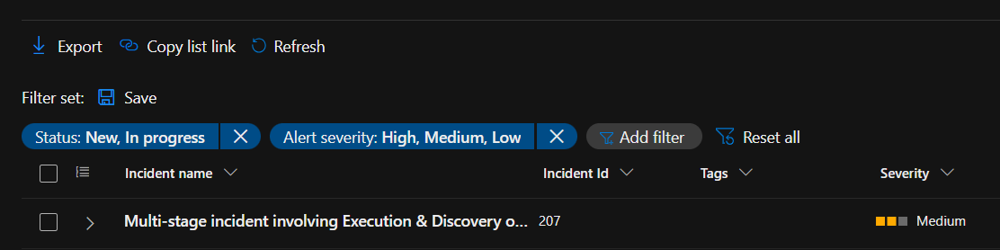
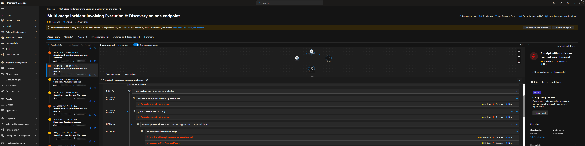
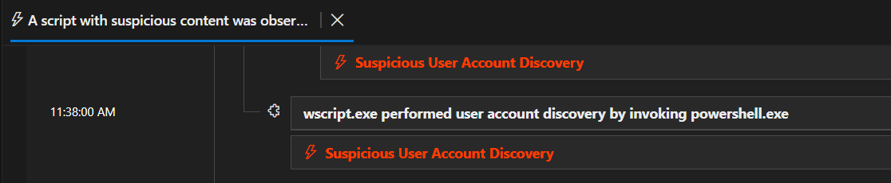

# RAT Discovery via Windows Defender

## Overview

This document outlines the discovery of a Remote Access Trojan (RAT) using Microsoft Defender. The threat was detected as part of a multi-stage incident involving suspicious script execution and user account discovery activity.

---

## Detection Summary

- **Tool Used:** Microsoft Defender
- **Severity:** Medium
- **Incident:** Multi-stage involving Execution & Discovery
- **Timeline:** Activity observed from December through May

> 

---

## Suspicious Activity Timeline

Microsoft Defender identified:

- `wscript.exe` invoking `powershell.exe`
- Execution of suspicious `.ps1` script
- Suspicious user account discovery behavior

> 

---

## Key Indicator

One specific alert flagged:

```plaintext
wscript.exe performed user account discovery by invoking powershell.exe
```

This behavior is commonly associated with post-exploitation reconnaissance.

> 

---

## Current Status

- Device remains online and active in the environment
- Defender history shows script-based recon still occurring
- Investigation has not yet resulted in containment or isolation

---

## Recommended Actions

- Immediately isolate the affected endpoint
- Perform a full scan and remove unauthorized scheduled tasks
- Review login history, token use, and session persistence
- Apply application whitelisting and PowerShell logging

---

## Next Steps

Additional review will include deeper analysis of:
- The original PowerShell script
- Potential C2 (Command and Control) communication
- Registry-based persistence or autorun methods

---

## Sample Code Analysis (RAT Script)

Below is a decoded summary of the malicious PowerShell code discovered:

- Heavy use of obfuscation to evade detection
- Calls to `wscript.exe` and `powershell.exe`
- Uses ActiveX to execute silently
- Creates a named mutex to avoid multiple executions
- Establishes persistence via Scheduled Task named `jQueryLibrary`
- Collects system data: username, hostname, IP, architecture
- Uses compression and Base64 encoding to exfiltrate data
- Attempts outbound C2 communication to `https://173.90.0.16:443`
- Loads and executes staged payloads using `Invoke-FruityC2`

> This script is a highly flexible and evasive Remote Access Trojan (RAT) built for stealth and control.
